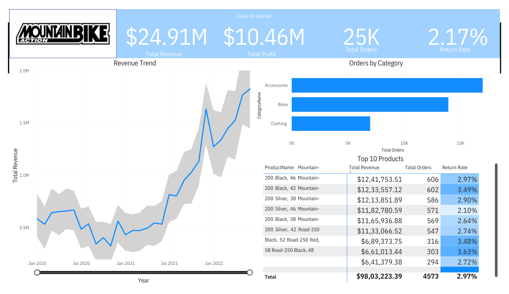
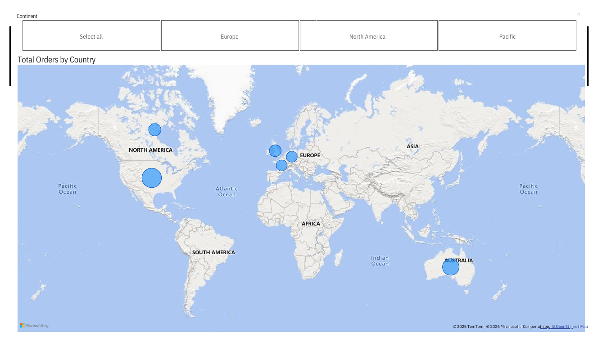

# Adventure Works Power BI Report

## Overview
This **Power BI report** provides comprehensive insights into sales performance, customer orders, and product profitability for **Adventure Works**. The dashboard includes interactive visualizations to analyze revenue trends, top-selling products, order distribution, and return rates.

## Dashboard Preview

## Key Metrics & Insights
- 📊 **Total Revenue**: $24.91M  
- 💰 **Total Profit**: $10.46M  
- 📦 **Total Orders**: 25K  
- 🔄 **Return Rate**: 2.17%  

## Features
- **Revenue Trend Analysis**: Track revenue changes over time.
- **Top 10 Products**: View top-performing products by revenue and return rate.
- **Order Distribution**: Analyze order volume by category and region.
- **Geographic Analysis**: Visualize total orders by country and continent.

- ## Product Overview: Mountain Bike

The dataset used in this Power BI report focuses on sales and trends related to **mountain bikes**. It provides insights into:
- 🚴 **Best-selling bike models**
- 🌍 **Sales performance by region**
- 📊 **Customer purchasing trends**

## Installation & Usage
1. **Prerequisites**
   - Install [Power BI Desktop](https://powerbi.microsoft.com/)
2. **Opening the Report**
   - Download the `.pbix` file from this repository.
   - Open it in Power BI Desktop.
3. **Exploring the Data**
   - Use filters and slicers for interactive analysis.
   - Click on visual elements to drill down into specific data.

## Data Source
This report is based on the **Adventure Works dataset**, a sample dataset widely used for business intelligence demonstrations.

## Recommendations
- **Improve Product Performance**: Identify and optimize low-performing products to increase revenue.
- **Reduce Return Rate**: Analyze reasons for product returns and improve quality or customer experience.
- **Expand High-Demand Categories**: Invest in product categories with the highest sales and customer interest.
- **Enhance Customer Engagement**: Implement targeted marketing campaigns based on purchasing behavior insights.

## Contribution
- Open an issue for any bugs or improvements.
- Feel free to submit pull requests with enhancements.
